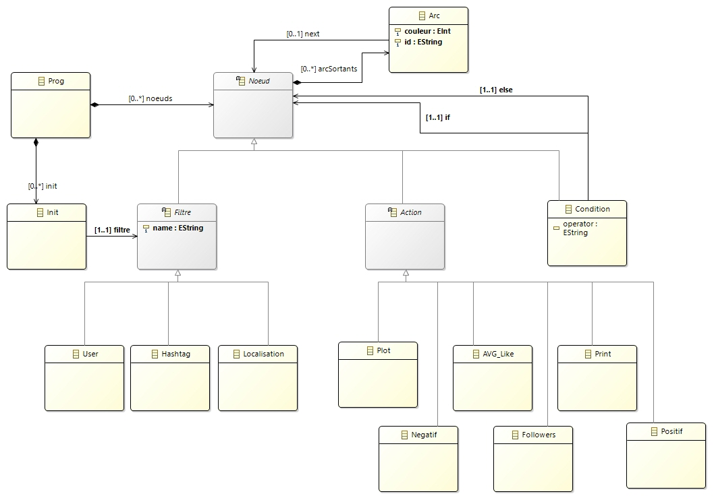
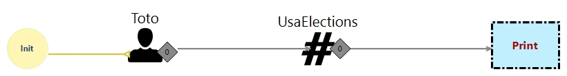
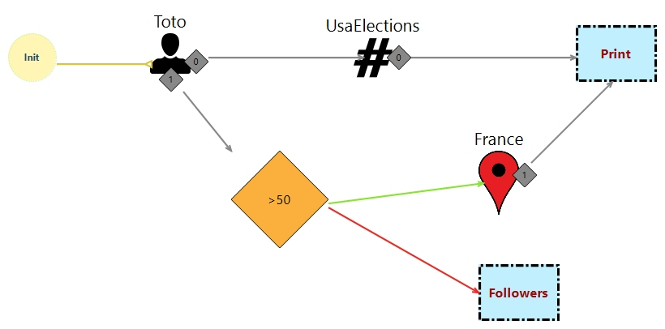
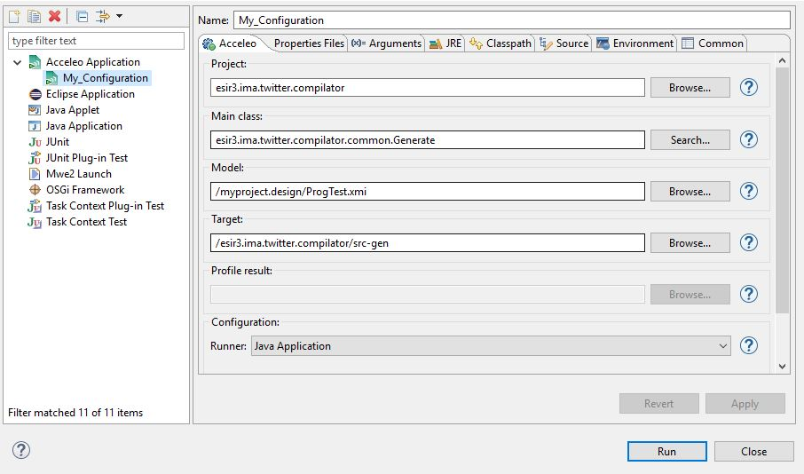

# Objectif du projet

Ce projet universitaire a pour but de mettre en pratique les acquis du cours d'Ingénirie de modèles de l'ESIR pour l'année universitaire 2016/2017 dans lequel la notion de DSL (Domain Specific Language) était au centre. 

A partir d'un métamodel Ecore de récupération et d'analyse de tweets que nous avons mis en place, l'objectif était de mettre en place :

- Un editeur graphique avec Sirius
- Un générateur de code qui génère du code java allant rechercher des tweets et des traitements à ces derniers selon les commandes du métamodèle.

# Métamodèle 


# Exemples de programme  
- Recuperer tous les tweets de toto ayant #UsaLections et les afficher. 



- Recupererd'une part tous les tweets de toto ayant #UsaLections et les afficher et d'autr,e parts si le nombre de tweets de Toto est supérieur à 50, filtrer ceux dans lesquels est mentionné France puis les afficher, sinon chercher tous ses followers.



# Note d'installation 

Il faut au préalable avoir eclipse modeling et s'assurer sur que les packages Acceleo et Sirius sont présents.

- Faire un clone du 
```sh
  git clone https://github.com/ymaiga/IMA.git
```

- Importer dans eclipse les projets :
  - ImaModel2
  - ImaModel2.edit
  - ImaModel2.editor
  - ImaModel2.tests
  
 - Toujours dans eclipse, faire un clic droit le projet et faire : run as > Eclipse Application 
 
 Une nouvelle instance d'eclipse se lance. Dans cette nouvelle instance, il faut importer les projets : 
 
 - myproject.desing
 - esir3.ima.twitter.compilator 
 
 Pour compiler le projet, il faut renseigner les champs suivants dans run configurations: 
 
 

Model : Choisir le fichier xmi 
Target: Chemin du répértoire où on veut génerer le code JAVA

# Technologies utilisées 

  - Sirius, Acceleo, Java, Twitter4J, RServe

# TODO
- Enrichir la liste des commandes de stats sur les tweets
